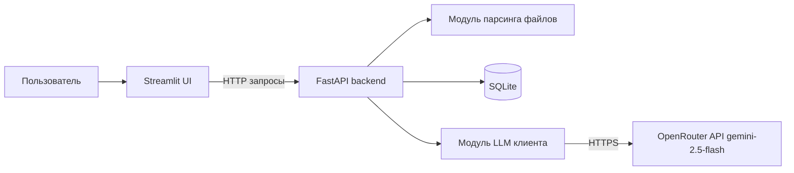
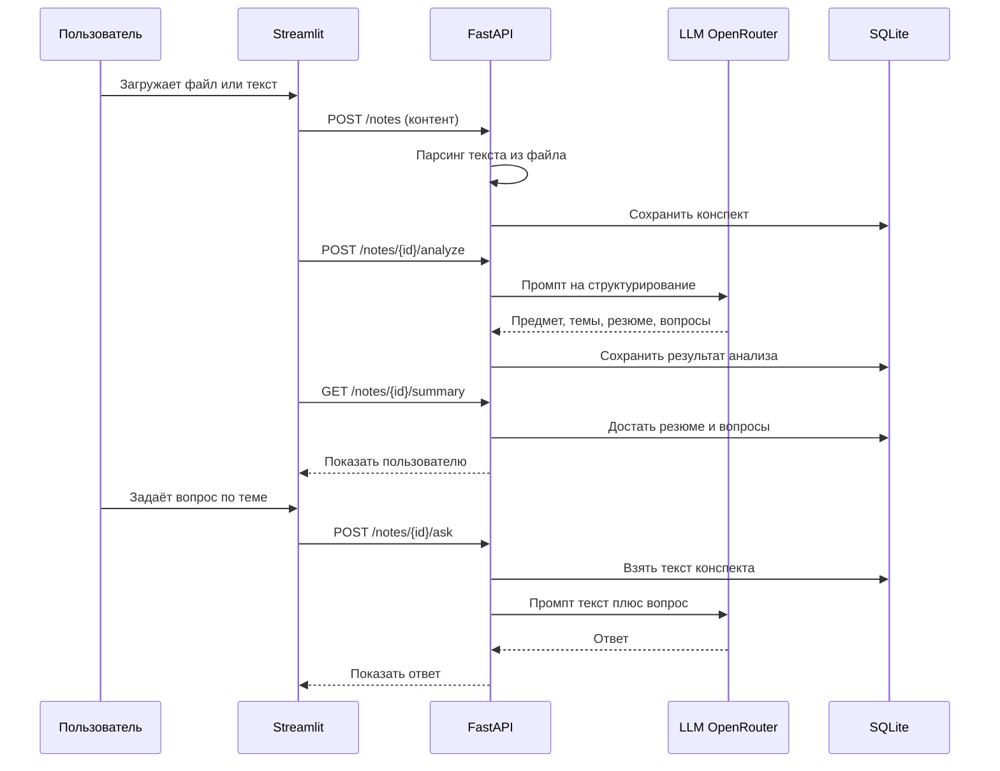
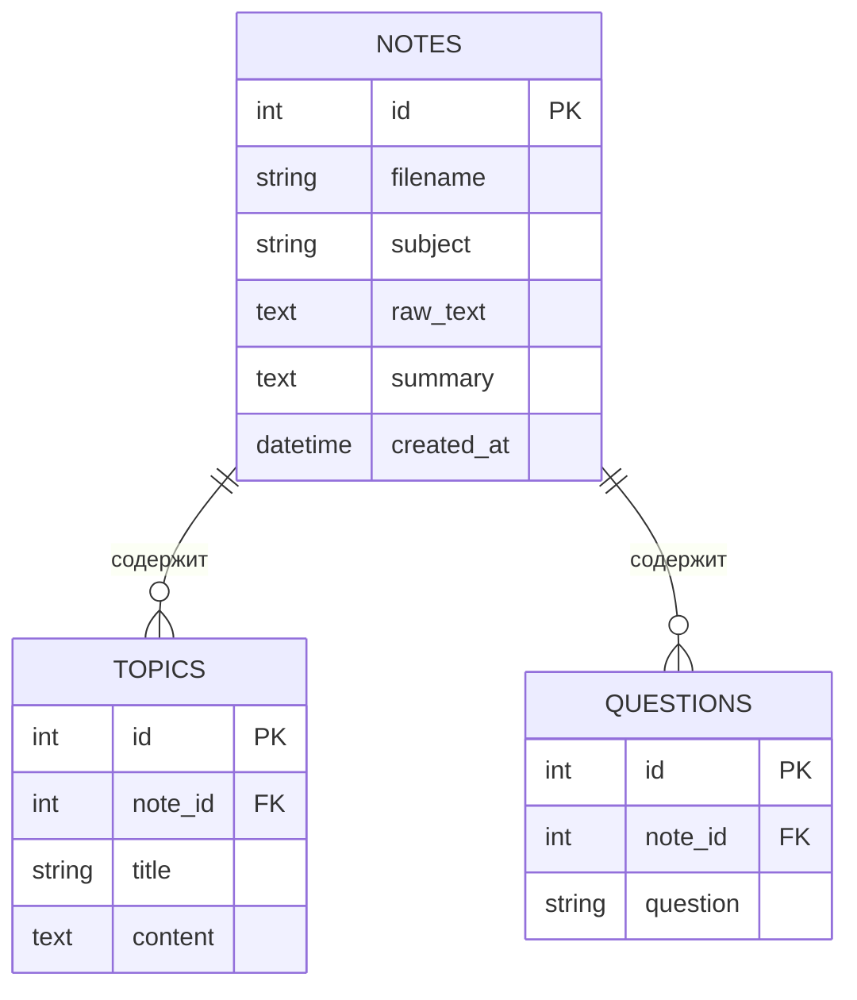
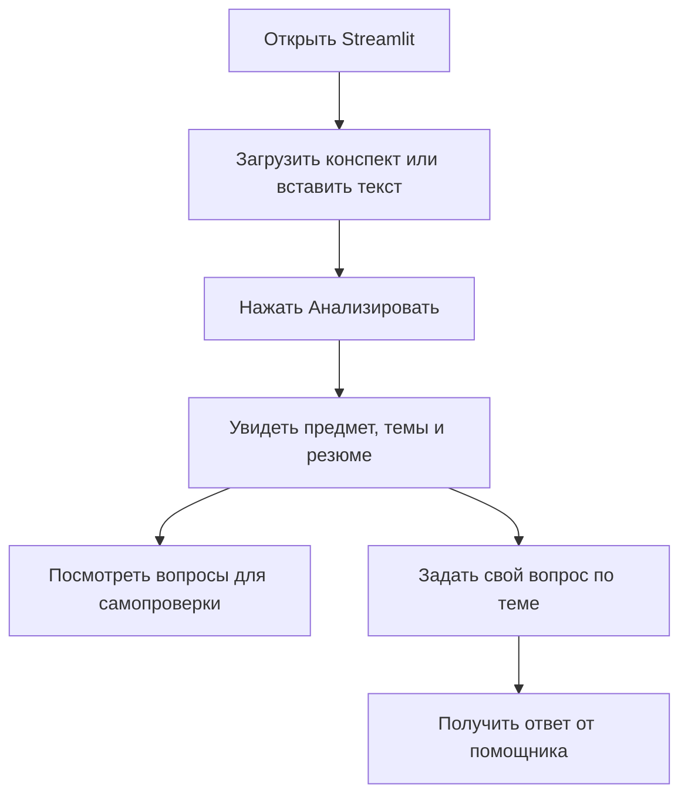

# Умный помощник по конспектам — Архитектура

Локальный пет-проект : загружаешь конспекты (текст / `.docx` / `.pdf`), приложение сохраняет их в базу, анализирует через LLM, выдаёт структурированное резюме (предмет, темы, ключевая информация), генерирует вопросы для самопроверки и отвечает на вопросы по конспекту.

---

## 1. Технологический стек

| Слой | Технология |
|------|-----------|
| Язык | Python 3.11+ |
| Фронтенд | Streamlit |
| Бэкенд | FastAPI (Uvicorn) |
| База данных | SQLite |
| LLM | OpenRouter API, модель `google/gemini-2.5-flash` |
| Парсинг файлов | `python-docx` (.docx), `pypdf` (.pdf) |

Запуск полностью локальный: один процесс FastAPI + один процесс Streamlit.

---

## 2. Общая архитектура



Принцип: Streamlit отвечает только за интерфейс и общается с бэкендом по HTTP. Вся логика (парсинг, БД, вызовы LLM) живёт в FastAPI.

---

## 3. Поток данных



---

## 4. Схема базы данных (SQLite)

Минимальный набор таблиц.



- `NOTES` — исходный конспект: имя файла, распознанный предмет, полный текст, общее резюме.
- `TOPICS` — выделенные из конспекта темы с краткой выжимкой по каждой.
- `QUESTIONS` — сгенерированные вопросы для самопроверки.

---

## 5. Эндпоинты FastAPI

| Метод | Путь | Назначение |
|-------|------|-----------|
| `POST` | `/notes` | Принять текст или файл (.docx/.pdf), распарсить, сохранить в БД, вернуть `id` |
| `POST` | `/notes/{id}/analyze` | Отправить текст в LLM, получить предмет + темы + резюме + вопросы, сохранить |
| `GET` | `/notes/{id}/summary` | Вернуть резюме, список тем и вопросов по конспекту |
| `POST` | `/notes/{id}/ask` | Ответить на вопрос пользователя по конспекту (текст + вопрос в промпт LLM) |
| `GET` | `/notes` | Список всех загруженных конспектов (id, предмет, имя файла) |

---

## 6. Модуль LLM (OpenRouter)

Отдельный файл-обёртка над HTTP-вызовом к OpenRouter:

- читает `OPENROUTER_API_KEY` из переменных окружения (`.env`);
- модель `google/gemini-2.5-flash`;
- одна функция отправки промпта и получения ответа;
- два сценария промптов:
  1. **Анализ конспекта** — просим LLM вернуть JSON: `subject`, `topics[]`, `summary`, `questions[]`.
  2. **Ответ на вопрос** — передаём релевантный текст конспекта + вопрос пользователя, получаем текстовый ответ.

Q&A реализуется просто: текст конспекта (или нужной темы) подставляется в промпт, без эмбеддингов и векторного поиска.

---

## 7. Модуль парсинга файлов

Одна функция «извлечь текст», которая по расширению выбирает обработчик:

- `.txt` / обычный текст — как есть;
- `.docx` — через `python-docx`;
- `.pdf` — через `pypdf`.

Возвращает обычную строку, которая дальше идёт в БД и в LLM.

---

## 8. Структура проекта

```
smart_notes_assistant/
├── docs/
│   └── architecture.md        # этот документ
├── backend/
│   ├── main.py                # FastAPI приложение и эндпоинты
│   ├── database.py            # подключение и инициализация SQLite
│   ├── models.py              # схемы/запросы к таблицам
│   ├── llm.py                 # клиент OpenRouter (gemini-2.5-flash)
│   ├── parser.py              # извлечение текста из файлов
│   └── prompts.py             # шаблоны промптов
├── frontend/
│   └── app.py                 # Streamlit интерфейс
├── .env.example               # пример: OPENROUTER_API_KEY=...
├── requirements.txt           # зависимости
└── README.md
```

---

## 9. Зависимости (requirements.txt)

```
fastapi
uvicorn
streamlit
requests
python-docx
pypdf
python-dotenv
```

SQLite используется через встроенный в Python модуль `sqlite3` — отдельная зависимость не нужна.

---

## 10. Запуск проекта

```bash
# 1. Установить зависимости
pip install -r requirements.txt

# 2. Прописать ключ OpenRouter в .env
cp .env.example .env

# 3. Запустить бэкенд
uvicorn backend.main:app --reload

# 4. В отдельном терминале запустить фронтенд
streamlit run frontend/app.py
```

---

## 11. Сценарий пользователя


